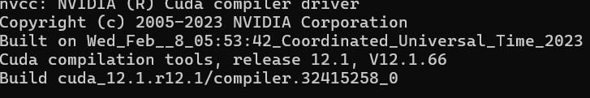
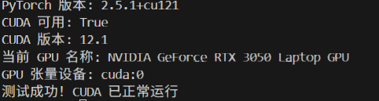

# 任务1打卡
## 1. 基础环境搭建
凭借之前在YOLO识别车辆轨迹项目中的相关经验，此次NLP的基础环境配置相对顺利。主要工作包括：
* 在指定的项目文件夹下建立虚拟环境: `conda create --prefix=.../base-llm python=3.10。包安装直接使用pip即可。
`
* 安装Pytorch-CUDA。首先需要打开cmd输入`nvcc --version`查看输出信息本机型为较旧的12.1版本，目前torch最新的包需CUDA>=12.6, 因此须在Pytorch官网上找到支持的历史版本。如最新支持12.1的version=2.5.1
* 环境验证：需要确保torch包（兼容）以及CUDA可以正常使用。验证代码见`TASK1.py`。如可正常运行输出如下
## 2.Markdown学习
实际为这段时间主要进行的工作。看到课程公告有这一要求,故决定尝试。主要参考 [菜鸟教程](https://www.runoob.com)感觉写出来确实效果不错，也没有很复杂，后面就使用这个写打卡笔记吧。