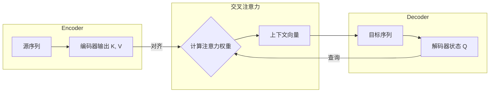
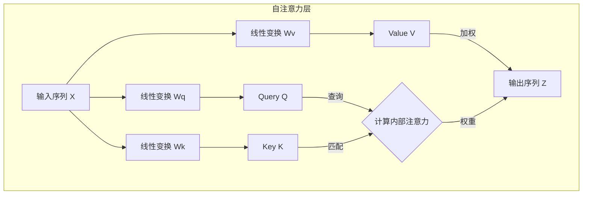

# Transformer

抛弃了传统的 RNN 和卷积网络，整个模型基于注意力机制来构建。Transformer 的提出在自然语言处理领域具有划时代的意义。它不仅凭借其出色的并行计算能力极大地提升了训练效率，还更有效地捕捉了文本中的长距离依赖关系，为后续的 BERT、GPT 等大规模预训练模型的诞生提供了架构基础。

## 一、自注意力机制

从根本上说，要让模型理解一段文本，就需要提取其“序列特征”，即将文本中所有词元的信息以某种方式整合起来。RNN 通过依次传递隐藏状态来顺序地整合信息，而 Transformer 则选择了一条截然不同的道路。其核心是 **自注意力机制**。它不再依赖于顺序计算，而是将提取序列特征的过程看作是输入序列“自己对自己进行注意力计算”。序列中的每个词元都会“审视”序列中的所有其他词元，来动态地计算出最能代表当前词元上下文含义的新表示。与上一节介绍的交叉注意力不同，在自注意力中，**Query、Key、Value 均来源于同一个输入序列**。

举个例子，在句子“苹果公司发布了新款手机，**它**采用了最新的芯片”中，要理解代词“它”指的是“新款手机”而不是“苹果公司”，模型就需要将“它”与句子中的其他词元进行关联。自注意力机制正是通过计算“它”对句中其他所有词的注意力权重来实现这一点的。

### 1.1 自注意力与交叉注意力的区别

从结构上看，自注意力与交叉注意力的区别在于**信息的来源和流动方向**。在交叉注意力机制中，信息在两个不同的序列之间流动。通常，**Query** 来自解码器（代表当前的目标序列状态），而 **Key** 和 **Value** 来自编码器的所有输出（代表完整的源序列信息）。其目的是在生成目标序列的每一步时，从源序列中寻找最相关的信息。



而在**自注意力**机制中，信息则是在**同一个序列内部**进行流动和重组。它的 **Query, Key, 和 Value 都来自同一个输入序列**。其目的是为了捕捉输入序列内部的依赖关系，重新计算序列中每个词元的表示，使其包含更丰富的上下文信息。



总结来说，尽管底层的加权求和计算方式相似，但两者在架构上的目标完全不同：

- **交叉注意力**：用于**对齐**和**整合**两个**不同**序列之间的信息。
- **自注意力**：用于**理解**和**重构**单个序列**内部**的依赖关系。

### 1.2 自注意力的计算过程

自注意力的计算过程与上一节介绍的 QKV 范式完全一致，关键区别在于 Q, K, V 的来源。

（1）**生成 Q, K, V 向量**：

对于输入序列中的**每一个**词元，首先获取其词嵌入向量 $x_i$。然后，将该向量分别与三个可学习的、在整个模型中共享的权重矩阵 $W^Q, W^K, W^V$ 相乘，生成该词元专属的 Query 向量 $q_i$、Key 向量 $k_i$ 和 Value 向量 $v_i$。

$$
q_i = x_i W^Q \\
k_i = x_i W^K \\
v_i = x_i W^V
$$

这三个矩阵的作用是将原始的词嵌入向量投影到不同的、专门用于注意力计算的表示空间中，赋予了模型更大的灵活性。

（2）**计算注意力分数**：

为了计算第 $i$ 个词元的新表示，需要用它的 Query 向量 $q_i$ 去和**所有**词元（包括它自己）的 Key 向量 $k_j$ 计算点积，得到注意力分数。

$$
\text{score}(i, j) = q_i \cdot k_j
$$

（3）**缩放与归一化**：

将得到的分数除以一个缩放因子 $\sqrt{d_k}$（$d_k$ 是 Key 向量的维度），然后通过 Softmax 函数进行归一化，得到最终的注意力权重 $\alpha_{ij}$。这个缩放步骤的目的与上一节中介绍的一致，都是为了在训练过程中保持梯度稳定。当向量维度 $d_k$ 较大时，点积结果的方差会增大，可能将 Softmax 函数推向其梯度极小的区域，从而导致梯度消失，影响模型学习。进行缩放可以有效缓解这个问题。

$$
\alpha_{ij} = \text{softmax}\left(\frac{q_i \cdot k_j}{\sqrt{d_k}}\right)
$$

4.  **加权求和**：

使用计算出的权重 $\alpha_{ij}$ 对**所有**词元的 Value 向量 $v_j$ 进行加权求和，得到第 $i$ 个词元经过自注意力计算后得到的新表示 $z_i$。

$$
z_i = \sum_j \alpha_{ij} v_j
$$

通过这个过程，输出向量 $z_i$ 不再仅仅包含原始词元 $x_i$ 的信息，而是融合了整个序列中所有与之相关词元的信息，成为一个上下文感知的、更丰富的表示。其本质可以理解为：序列中的每个词元都同时扮演着“查询（Q）”、“键（K）”和“值（V）”三种角色。通过计算查询与其他所有词元的键之间的相关性，来决定如何加权融合所有词元的值，从而为每个词元生成一个全新的、深度融合了全局上下文信息的表示。

> 既然 Q, K, V 都来自同一个输入 X，为什么不直接用 X 计算，而要引入三个独立的权重矩阵 $W^Q, W^K, W^V$？甚至，为什么是三个，而不是两个或四个？
>
> 这可以类比在图书馆查资料的过程：
> - **Query (Q) - 要问的问题**：代表了我们主动想查询的意图。
> - **Key (K) - 书的索引/标签**：代表了书本内容的关键特征，用于被动地和你的问题进行匹配。
> - **Value (V) - 书的具体内容**：代表了书本实际包含的信息。
>
> 我们的“问题”和书本的“索引”可能都源于同一个知识领域（同一个输入 X），但它们在信息检索这个任务中扮演的角色是截然不同的。$W^Q, W^K, W^V$ 这三个矩阵的作用，就是让模型学会将原始输入 X 投影到三个功能不同的空间中，分别去扮演好“查询者”、“被查询的索引”和“信息提供者”这三种角色。Q-K 配对解决了“如何定位相关信息”的问题，而 V 提供了“应该提取什么信息”的答案。这个三元组结构在功能上是完备且高效的，所以成为了注意力机制的标准范式。

### 1.3 矩阵运算与并行化

上述步骤描述的是单个词元 $i$ 的计算过程。在实际应用中，如果采用循环的方式逐个计算每个词元的 $z_i$，效率会非常低下。自注意力的巨大优势在于其**并行计算**能力，这通过将整个过程表达为矩阵运算来实现。

假设整个输入序列的词嵌入矩阵为 $X$（维度为 `[sequence_length, embedding_dim]`），可以一次性计算出所有词元的 Q, K, V 矩阵：

$$
Q = X W^Q \\
K = X W^K \\
V = X W^V
$$

然后，整个自注意力的输出矩阵 $Z$ 可以通过一个公式完成计算：

$$
Z = \text{Attention}(Q, K, V) = \text{softmax}\left(\frac{QK^T}{\sqrt{d_k}}\right)V
$$

这个公式与上一节中介绍的通用注意力公式完全相同。这里的主要区别不在于数学运算，而在于**输入的来源**：

- 在上一节的**交叉注意力**中，Q 来自一个序列（解码器），而 K 和 V 来自另一个序列（编码器）。
- 在当前的**自注意力**中，矩阵 Q、K 和 V **全部派生自同一个输入序列 X**。

所以，同一个数学范式，根据输入来源的不同，被用于解决两个不同的问题，一个是两个序列之间的对齐，另一个是单个序列内部的依赖关系建模。在这个公式中， $QK^T$ 的计算结果是一个维度为 `[sequence_length, sequence_length]` 的注意力分数矩阵，其中第 $i$ 行第 $j$ 列的元素表示第 $i$ 个词元对第 $j$ 个词元的注意力分数（未归一化的 logits）。注意力权重来自对缩放分数应用 Softmax 后得到的归一化系数。

### 1.4 PyTorch 实现自注意力

从概念上讲，自注意力的计算可以分解为对序列中每个词元进行循环操作，这种方式虽然直观但效率极低。因此，现代深度学习框架中的实现都采用了**矩阵运算**的方式。通过将整个序列的 Q, K, V 看作矩阵，利用一次大规模的矩阵乘法，就能并行地完成所有词元之间的相关性计算。下面是这种并行化版本的实现：

```python
class SelfAttention(nn.Module):
    """自注意力模块"""
    def __init__(self, hidden_size):
        super(SelfAttention, self).__init__()
        self.hidden_size = hidden_size
        self.q_linear = nn.Linear(hidden_size, hidden_size)
        self.k_linear = nn.Linear(hidden_size, hidden_size)
        self.v_linear = nn.Linear(hidden_size, hidden_size)
        
    def forward(self, x):
        q = self.q_linear(x)
        k = self.k_linear(x)
        v = self.v_linear(x)
        
        scores = torch.matmul(q, k.transpose(-2, -1)) / math.sqrt(self.hidden_size)
        attention_weights = torch.softmax(scores, dim=-1)
        context = torch.matmul(attention_weights, v)
        
        return context
```

- **`__init__`**: 初始化了三个 `nn.Linear` 层，它们分别对应将输入映射到 Q, K, V 空间的权重矩阵 $W^Q, W^K, W^V$。
- **`forward`**:
    - `q_linear(x)`, `k_linear(x)`, `v_linear(x)`：将形状为 `[batch_size, seq_len, hidden_size]` 的输入张量 `x` 分别通过三个线性层，一次性地为序列中的所有词元计算出 Q, K, V 矩阵。
    - `torch.matmul(q, k.transpose(-2, -1))`: 这是实现并行计算的核心。通过将 K 矩阵的最后两个维度转置（`seq_len, hidden_size` -> `hidden_size, seq_len`），再与 Q 矩阵相乘，直接得到了一个 `[batch_size, seq_len, seq_len]` 的分数矩阵。该矩阵中的 `scores[b, i, j]` 代表了批次 `b` 中第 `i` 个词元对第 `j` 个词元的注意力分数。
    - `/ math.sqrt(self.hidden_size)`：执行缩放操作，防止梯度消失。
    - `torch.softmax(scores, dim=-1)`：对分数的最后一个维度（`seq_len`）进行 Softmax，得到归一化的注意力权重。
    - `torch.matmul(attention_weights, v)`：将权重矩阵与 V 矩阵相乘，完成了对所有词元的 Value 向量的加权求和，得到最终的上下文感知表示。

## 二、多头注意力机制

仅仅用一组 $W^Q, W^K, W^V$ 矩阵进行一次自注意力计算，相当于只从一个“视角”来审视文本内在的关系。然而，文本中的关系是多层次的，例如，一组参数可能学会了关注代词（如 “它” 指向谁）的关系，但可能忽略了动作的执行者（主谓宾）等其他类型的关系。

为了让模型能够综合利用从不同维度和视角提取出的信息，Transformer 引入了**多头注意力机制 (Multi-Head Attention)**。其思想非常直接：并行地执行多次自注意力计算，每一次计算都是一个独立的“头 (Head)”。每个头都拥有一组自己专属的 $W^Q_i, W^K_i, W^V_i$ 权重矩阵，并且可以学习去关注一种特定类型的上下文关系。

> 那么，多头注意力与我们之前讨论的“增加 A, B, C 等新角色”有什么不同呢？
>
> 一个关键的区别：多头注意力**不是**通过增加 A, B, C 等新角色来**深化**单次注意力计算的复杂性，而是通过并行运行多个独立的 QKV 计算单元来**拓宽**其广度。
>
> 再次使用图书馆的类比：
> *   **增加 A, B, C**：相当于给**一个**图书管理员一套更复杂的工具，让他一次性处理问题(Q)、索引(K)、内容(V)之外，还要考虑主题(A)、背景(B)等，这会使单次查询过程变得非常复杂。
> *   **多头注意力**：相当于**雇佣一个各有所长的专家团队**（比如 8 个管理员，即 8 个“头”）。每个专家都只使用标准高效的 QKV 工具，但他们各自有独特的视角（独立的 $W^Q_i, W^K_i, W^V_i$ 矩阵）。一个专家可能专攻语法，另一个专攻语义。最后，将所有专家的报告汇总起来，得到一个更全面、更丰富的结论。
>
> 因此，多头注意力机制为模型提供了从不同子空间、不同视角审视信息的能力，而不是改变注意力计算本身的范式。

具体流程如下：

（1）**并行计算**：假设有 $h$ 个头，那么就初始化 $h$ 组不同的权重矩阵 $(W^Q_0, W^K_0, W^V_0), (W^Q_1, W^K_1, W^V_1), \dots, (W^Q_{h-1}, W^K_{h-1}, W^V_{h-1})$。

（2）**独立注意力**：对于输入序列，每个头都独立地执行一次完整的自注意力计算，产生一个输出矩阵 $Z_i$。

（3）**拼接与投影**：将所有 $h$ 个头的输出矩阵 $Z_0, Z_1, \dots, Z_{h-1}$ 在特征维度上进行**拼接 (Concatenate)**。

（4）**最终输出**：将拼接后的巨大矩阵乘以一个新的权重矩阵 $W^O$，将其投影回原始的输入维度，得到多头注意力机制的最终输出。

多头机制允许模型在不同的表示子空间中共同学习上下文信息。例如，一个头可能专注于捕捉长距离的语法依赖，而另一个头可能更关注局部的词义关联。这种设计极大地增强了模型的表达能力。

在实践中，为了保持计算总量不变，通常会将原始的词嵌入维度 `embedding_dim` 均分给 $h$ 个头。例如，如果 `embedding_dim=512`，有 `h=8` 个头，那么每个头产生的 Q, K, V 向量维度就是 `d_k = d_v = 512 / 8 = 64`。计算时，先将输入 $X$ 分别投影到 $h$ 组低维的 Q, K, V 向量，并行计算后，再将结果拼接并投影回 `embedding_dim` 维度。

### 2.1 PyTorch 实现多头注意力

多头注意力是通过并行运行多个独立的自注意力“头”，并融合它们的输出来增强模型的表达能力。一个低效的实现是简单地创建多个 `SelfAttention` 实例并拼接结果。而高效的实现则是将多个头的计算逻辑合并到一次矩阵运算中。

```python
class MultiHeadSelfAttention(nn.Module):
    """多头自注意力模块"""
    def __init__(self, hidden_size, num_heads):
        super(MultiHeadSelfAttention, self).__init__()
        assert hidden_size % num_heads == 0, "hidden_size 必须能被 num_heads 整除"
        
        self.hidden_size = hidden_size
        self.num_heads = num_heads
        self.head_dim = hidden_size // num_heads
        
        self.q_linear = nn.Linear(hidden_size, hidden_size)
        self.k_linear = nn.Linear(hidden_size, hidden_size)
        self.v_linear = nn.Linear(hidden_size, hidden_size)
        self.wo = nn.Linear(hidden_size, hidden_size)

    def forward(self, x):
        batch_size, seq_len, _ = x.shape
        
        q = self.q_linear(x)
        k = self.k_linear(x)
        v = self.v_linear(x)
        
        # 拆分多头
        q = q.view(batch_size, seq_len, self.num_heads, self.head_dim).transpose(1, 2)
        k = k.view(batch_size, seq_len, self.num_heads, self.head_dim).transpose(1, 2)
        v = v.view(batch_size, seq_len, self.num_heads, self.head_dim).transpose(1, 2)
        
        # 并行计算注意力
        scores = torch.matmul(q, k.transpose(-2, -1)) / math.sqrt(self.head_dim)
        attention_weights = torch.softmax(scores, dim=-1)
        context = torch.matmul(attention_weights, v)
        
        # 合并多头结果
        context = context.transpose(1, 2).contiguous().view(batch_size, seq_len, self.hidden_size)
        
        # 输出层
        output = self.wo(context)
        
        return output
```

- **`__init__`**:
    - `head_dim`：计算出每个头的维度，即 `hidden_size / num_heads`。
    - `q_linear, k_linear, v_linear`：与单头类似，但这里的线性层输出维度仍然是 `hidden_size`。这是为了**一次性计算出所有头所需的总特征**。
    - `wo`：对应于多头注意力机制中的输出权重矩阵 $W^O$，用于融合所有头的信息。
- **`forward`**:
    - **线性变换**: 与单头版本相同，得到总的 Q, K, V 矩阵。
    - **拆分多头**: 
        - `.view(batch_size, seq_len, self.num_heads, self.head_dim)`: 首先，将 `hidden_size` 维度逻辑上拆分为 `num_heads` 和 `head_dim` 两个维度。此时张量形状变为 `[batch, seq_len, num_heads, head_dim]`。
        - `.transpose(1, 2)`: 然后，交换 `seq_len` 和 `num_heads` 维度，得到 `[batch, num_heads, seq_len, head_dim]`。这一步是为了让 `num_heads` 成为一个类似批次 (batch) 的维度，使得后续的矩阵乘法可以在每个头内部独立、并行地进行。
    - **并行计算注意力**: `torch.matmul(q, k.transpose(-2, -1))` 现在是一个四维张量的乘法。PyTorch 会自动地将其解释为在第 0 和第 1 维（`batch` 和 `num_heads`）上进行批处理，而对最后两个维度执行矩阵乘法。这样就实现了所有头的注意力分数计算的并行化。
    - **合并多头**: 这是拆分操作的逆过程。
        -   `.transpose(1, 2)`: 先将 `num_heads` 和 `seq_len` 维度换回来，形状变为 `[batch, seq_len, num_heads, head_dim]`。
        -   `.contiguous()`: 由于 `transpose` 操作可能导致张量在内存中不是连续存储的，需要调用 `.contiguous()` 来确保内存连续，之后才能安全地使用 `.view()`。
        -   `.view(batch_size, seq_len, self.hidden_size)`: 最后，将 `num_heads` 和 `head_dim` 两个维度重新合并成 `hidden_size` 维度，完成了所有头输出的拼接。
    - **输出投影**: 将合并后的结果通过 `wo` 线性层，得到最终输出。

## 三、Transformer 整体结构

依然是一个 Encoder-Decoder 架构，但其内部是由几个标准化的“积木”堆叠而成的。Transformer 的 Encoder 和 Decoder 都是由 N 个（原论文中 N=6）功能相同的层（Layer）堆叠而成。下面我们分别来看它们的内部构造。

### 3.1 编码器（Encoder）

编码器的作用是“理解”和“消化”输入的整个序列，为序列中的每个词元生成一个富含上下文信息的表示。一个标准的**编码器层**由两个主要的**子层**构成，分别是**多头自注意力层（Multi-Head Self-Attention Layer）**和**位置前馈网络（Position-wise Feed-Forward Network）**。每个子层的输出都经过了 **残差连接（Add）** 与 **层归一化（Norm）** 处理。所以，一个编码器层内部的数据流可以表示为 `x -> Sublayer1(x) -> Add & Norm -> Sublayer2(...) -> Add & Norm`。

**关键特性**：
- **注意力类型**：编码器中的多头注意力层是**双向的自注意力**。这意味着在计算时，序列中的任何一个词元都可以“看到”序列中的所有其他词元（包括它自己、它前面的和它后面的）。
- **功能**：由于其双向性，编码器非常擅长**理解**完整的输入文本，并为每个词元生成一个深度融合了上下文信息的表示。
- **应用**：通过大量堆叠编码器层而构建的模型（Encoder-Only 架构），如 **BERT**，在文本分类、命名实体识别等自然语言理解（NLU）任务上取得了巨大成功。

### 3.2 解码器（Decoder）

解码器的作用是基于编码器对原始输入的理解，并结合已经生成的部分，来逐个生成下一个词元。为了完成这个更复杂的任务，一个标准的**解码器层（Decoder Layer）**比编码器层多了一个注意力子层，总共包含**三个子层**。分别是**带掩码的多头自注意力层（Masked Multi-Head Self-Attention Layer）**、**交叉注意力层（Cross-Attention Layer）**和**位置前馈网络（Position-wise Feed-Forward Network）**。同样，解码器的每个子层也都采用了残差连接和层归一化。

**关键特性**：
-   **子层 1：带掩码的自注意力**
    -   与编码器层相比，这是解码器的第一个主要区别。解码器在生成序列时必须是**自回归**的，即在生成第 $t$ 个词元时，只能依赖于已经生成的前 $t-1$ 个词元，而不能“看到”未来的信息。
    -   为了在并行的自注意力计算中实现这一点，需要引入**掩码 (Masking)**。在计算 Softmax 之前，一个“未来词元掩码”会被应用到注意力分数上，将所有未来位置的分数设置为一个极小的负数（如 `-inf`），这样在经过 Softmax 之后，这些位置的注意力权重就会变为 0，从而确保了模型的单向性。
-   **子层 2：交叉注意力**
    -   这是连接编码器和解码器的桥梁。这一层的实现与上一节中描述的交叉注意力一致。
    -   它的 **Key 和 Value 来自于编码器的最终输出**，而 **Query 则来自于解码器前一个子层（即带掩码的自注意力层）的输出**。
    -   这一层允许解码器在生成每个词元时，能够“关注”到输入序列的所有部分，从而有针对性地提取所需信息。
-   **子层 3：逐位置前馈网络 (FFN)**
    -   这部分与编码器中的 FFN 相同，为模型提供非线性变换能力。
-   **大模型应用**：通过大量堆叠解码器层而构建的模型（Decoder-Only 架构），如 **GPT** 系列，由于其天然的自回归生成能力，引领了当前大语言模型（LLM）的发展浪潮。

### 3.3 组件解析

下面来详细解析一下构成上述“层”的几个重要组件。

#### 3.3.1 位置前馈网络 (FFN)

这是一个由两次线性变换和一个激活函数组成的全连接网络，它独立地应用于序列中的**每一个位置**。
- **作用**：特征变换。注意力子层内部主要包含 Softmax 归一化；逐位置的非线性主要由 FFN 提供（常见 ReLU/GELU）。
- **内部结构**：其常见的结构是“升维-激活-降维”。
    
    $$
    \text{FFN}(x) = \text{ReLU}(xW_1 + b_1)W_2 + b_2
    $$
    
    - 第一次线性变换（ $W_1$ ）通常会将输入维度 `embedding_dim` 放大到 4 倍（`4 * embedding_dim`）。这种**升维**操作的作用是将特征投影到一个更高维的空间，以便提取更丰富、更复杂的模式。
    - 使用一个激活函数（如 ReLU）进行非线性处理。
    - 第二次线性变换（ $W_2$ ）再将维度从 `4 * embedding_dim` 压缩回原始的 `embedding_dim`。这种**降维**操作可以看作是对高维特征的筛选和压缩，保留最重要的信息。

> 将中间层维度设为 4 倍的做法，主要是继承自原始论文的经验设定。

#### 3.3.2 残差连接与层归一化 (Add & Norm)

为了让这些层能够成功地“堆叠”起来，每个子层的后面都连接了这个组合。

- **Add (残差连接)**：解决了深度网络的“模型退化”问题。从反向传播的角度看，子层的输出可以写成 $y = x + \text{Sublayer}(x)$。在计算梯度时， $\frac{\partial y}{\partial x} = 1 + \frac{\partial \text{Sublayer}(x)}{\partial x}$。其中“1”的存在为梯度创建了一条“高速公路”，确保无论网络有多深，梯度都能至少以大小为 1 的程度回传到最浅层，极大地稳定了训练过程。同时，这也要求模型中所有子层的输入和输出维度必须保持一致，以便进行元素相加。
- **Norm (层归一化)** ：用于稳定训练过程。它独立地对**每个样本的每个词元**的特征向量（即 `hidden_size` 维度）进行标准化，使其均值变为 0，方差变为 1（但这并不假设其原始分布为正态分布）。更重要的是，它引入了两个可学习的参数 $\gamma$（缩放）和 $\beta$（偏移），让模型可以自主学习最佳的数据分布，其完整公式为：

    $$
    y = \frac{x - \mu}{\sqrt{\sigma^2 + \epsilon}} \cdot \gamma + \beta
    $$
    
    这使得模型既能享受到归一化带来的稳定性，又具备了根据任务需要恢复或调整原始分布的能力。与主要用于计算机视觉的 Batch Normalization（对一个批次中所有样本的同一特征进行归一化）相比，Layer Normalization 不受批次大小的影响，更适合处理长度可变的自然语言序列。

这个设计使得模型可以通过简单地增加“层”的数量（即深度）和特征维度（即宽度）来进行扩展，为后来参数量巨大的语言模型奠定了基础。

> 原论文采用 Post-LN（Sublayer → Add → LayerNorm）。许多现代实现（如 GPT 系列）采用 Pre-LN（LayerNorm → Sublayer → Add），训练更稳定、更易加深，但功能等价。

### 3.4 位置编码

自注意力机制的主要缺陷在于其 **位置无关性**。由于计算是完全并行的，模型无法感知词元的顺序。例如，“猫追狗”和“狗追猫”这两个句子，在自注意力看来，它们的词元集合完全相同，因此会为“猫”和“狗”生成相同的上下文表示，这显然是错误的。为了解决这个问题，Transformer 在将词嵌入向量输入模型之前，为它们加入了一个 **位置编码 (Positional Encoding)** 向量。其工作方式非常直接：

$$ input_\text{embedding} = token_\text{embedding} + positional_\text{encoding} $$

这个额外注入的向量为每个词元提供了其在序列中的位置信息。这是一种 **绝对位置编码**，即每个位置（如第 0、1、2 个位置）都有一个固定的编码向量。在实践中，主要有两种实现方式：

（1）**可学习的位置编码 (Learned Positional Encoding)**

- 在 Encoder-only 模型（如 BERT）中常见；而近年的大型解码器式模型多采用相对/旋转类位置编码（如 RoPE）。
- 其实现非常简单：创建一个 `nn.Embedding` 层，大小为 `[max_sequence_length, hidden_size]`。`max_sequence_length` 是模型能处理的最大序列长度，这是一个重要的超参数（在很多模型配置文件中被称为 `max_position_embeddings`）。在训练时，模型会像学习词嵌入一样，自动学习出每个位置（0, 1, 2, ...）最合适的向量表示。

（2）**基于三角函数的固定编码 (Sinusoidal Positional Encoding)**

- 这是原版 Transformer 论文中使用的方法，它不需要学习。
- 使用不同频率的正弦和余弦函数来为每个位置生成一个独特的、固定的编码向量：

    $$
    PE_{(\text{pos}, 2i)} = \sin\left(\frac{\text{pos}}{10000^{\frac{2i}{d_{\text{embedding}}}}}\right) \\
    PE_{(\text{pos}, 2i+1)} = \cos\left(\frac{\text{pos}}{10000^{\frac{2i}{d_{\text{embedding}}}}}\right)
    $$

    其中：
    - $pos$ 是词元在序列中的绝对位置（如第 0 个、第 1 个词...）。
    - $i$ 是编码向量中的维度索引（从 0 到 $d_{embedding}$/2）。公式通过 $i$ 来同时计算偶数维度 $2i$ 和奇数维度 $2i+1$ 的值，因此 $i$ 的取值范围只需达到维度总数的一半。
    - $d_{embedding}$ 是词嵌入的维度。
    
    公式利用不同频率的正弦和余弦函数，为 $d_{embedding}$ 维编码向量的每一个维度（$2i$ 对应偶数位，$2i+1$ 对应奇数位）计算一个特定的值。由于每个位置 $pos$ 和每个维度 $i$ 的组合都是独一无二的，所以这种方法能为序列中的每个位置生成一个完全独特的编码向量。这种方法的优势是不同位置的编码向量之间存在固定的线性关系，这可能有助于模型推断出词元间的相对位置。其主要优点是不需要训练，并且理论上可以外推到比训练时遇到的更长的序列。

> **绝对 vs. 相对位置编码**
>
> 上述两种方法都属于**绝对位置编码**，因为它们为每个绝对位置（第 1 个、第 10 个等）分配一个特定的编码。然而，这种方式在处理超长文本时可能存在泛化性问题。因此，许多现代的大语言模型（如 Transformer-XL, Llama）转而采用**相对位置编码**。这种方法不再关注词元的绝对位置，而是直接在注意力计算中建模词元之间的相对距离（例如，“当前词”与“前 2 个词”之间的关系），这被证明在处理长序列时更有效、更灵活。

### 3.5 注意力掩码

掩码是 Transformer 模型中一个重要的机制。其**主要目的**是确保解码器在生成序列时的**自回归**特性，即不能“看到”未来的信息。此外，作为一个**通用的工程实践**，掩码也被用来处理批量训练中因句子长度不同而引入的填充（Padding）问题。Transformer 主要使用以下两种掩码：

（1）因果掩码：因果掩码专用于解码器的**带掩码的自注意力（Masked Self-Attention）**子层，是为了确保解码过程遵循**自回归（Auto-regressive）**特性，即生成第 $i$ 个词元时只能依赖前 $i-1$ 个词元的信息，而绝不能“偷看”到 $i$ 及之后位置的内容。它的实现核心是确保注意力权重矩阵呈现**下三角矩阵**的形态。对于长度为 $T$ 的序列，在 $[T, T]$ 的矩阵中，主对角线及以下的位置被标记为可关注（如 `True` 或 0），而主对角线以上的位置则被标记为屏蔽（如 `False` 或 1）。在计算 Softmax 之前，所有被屏蔽位置的注意力分数会被加上一个极大的负数（如 `-inf`），迫使其注意力权重归零，从而物理上切断了信息的向后传播路径。

（2）填充掩码：填充掩码广泛应用于编码器和解码器的所有注意力层，目的是解决变长序列批量处理时的 **填充（Padding）** 问题。由于填充词元（如 `<pad>`）本身不携带语义信息，若模型对其分配注意力，不仅浪费计算资源，还会引入噪声干扰。填充掩码的作用就是在计算注意力分数后，将所有涉及填充词元的位置（无论是作为查询 Query 还是作为键 Key）的对应分数强制设为极大的负数（如 `-1e9` 或负无穷）。假设有一个注意力分数矩阵，维度为 `[batch_size, num_heads, seq_len, seq_len]`。填充掩码会是一个 `[batch_size, 1, 1, seq_len]` 的矩阵（或可广播的形状），标记了哪些位置是填充。在进行 Softmax 之前，这个掩码会被加到分数矩阵上。经过 Softmax 运
算后，这些负无穷位置的注意力权重会趋近于 0，从而在后续的加权求和中被完全忽略。

在解码器的自注意力层中，这两种掩码通常会结合使用，确保模型既不会关注到未来的信息，也不会关注到填充位。

### 3.6 解码器推理与 KV 缓存

解码器在训练和推理时的行为有很大不同。训练时，模型可以看到完整的“正确答案”序列，并通过注意力掩码来并行计算所有位置的损失。然而，在**推理**时，模型必须逐个生成词元，这是一个**自回归**的过程：

（1）输入 `[BOS]`（开始符），生成第一个词 `token_1`。

（2）输入 `[BOS], token_1`，生成第二个词 `token_2`。

（3）输入 `[BOS], token_1, token_2`，生成第三个词 `token_3`。

（4）... 直到生成 `[EOS]`（结束符）或达到最大长度。

如果按照这个流程直接计算，效率会非常低下。例如，在生成 `token_3` 时，模型需要为 `[BOS]` 和 `token_1` 重新计算它们的 Q, K, V 向量并参与注意力计算。但事实上，`[BOS]` 和 `token_1` 的 Key 和 Value 向量在之前的步骤中已经被计算过了。

为解决这种冗余计算，推理时会采用一项关键的优化技术：**KV 缓存**。
- **基本原理**：对于解码器的每一层，都缓存下截至当前时刻已经计算出的所有词元的 **Key** 和 **Value** 向量。
- **工作流程**：在生成第 $t$ 个词元时，模型只需要为当前输入的第 $t-1$ 个词元计算出它自己的 $q_{t-1}, k_{t-1}, v_{t-1}$。然后，它从缓存中取出历史的 $K_{cache} = [k_0, k_1, ..., k_{t-2}]$ 和 $V_{cache} = [v_0, v_1, ..., v_{t-2}]$。最后，将新的 $k_{t-1}, v_{t-1}$ 追加到缓存中，并用 $q_{t-1}$ 与更新后的完整 $K_{cache}, V_{cache}$ 进行注意力计算。

通过 KV 缓存，每次解码步骤的计算量从与整个已生成序列长度的平方（$O(T^2)$）相关，降低到只与序列长度（$O(T)$）线性相关，极大地加速了文本生成的速度，是实现高效大模型推理的常用技术之一。需要注意，KV 缓存占用会随步数线性增长（$O(T)$），在多层多头设置下需关注显存开销。

## 四、Transformer 代码实践


### 4.1 项目结构设计

为了更好地理解 Transformer 的内部工作机制，接下来尝试从零实现一个完整的 Transformer 模型。我们会采用**“先整体框架，后组件实现”**的思路，拆分多个文件来构建项目。在前面我们详细分析了 Transformer 的几大核心组件，分别是**位置编码**、**多头注意力**、**前馈网络 **以及**归一化**。为了体现这些组件的独立性和复用性，我们将遵循**模块化**的设计原则，将它们拆分到 `src/` 目录下的独立文件中，而将模型的组装和运行逻辑放在根目录的 `main.py` 中。目录设计如下：

```text
code/C4/transformer/
├── src/
│   ├── transformer.py  # 核心框架：定义 Transformer、EncoderLayer 和 DecoderLayer
│   ├── attention.py    # 核心组件：多头注意力机制 (MultiHeadAttention)
│   ├── ffn.py          # 核心组件：前馈神经网络 (FeedForward)
│   ├── norm.py         # 辅助组件：层归一化 (LayerNorm)
│   └── pos.py          # 辅助组件：位置编码 (PositionalEncoding)
└── main.py             # 入口脚本：组装模型并演示前向传播
```

### 4.2 搭建整体框架

在开始编写具体的注意力机制或前馈网络之前，我们可以先在 `src/transformer.py` 中勾勒出模型的高层架构。这种**“自顶向下”**的编程方式有助于我们理清数据流向。通过前面的学习我们知道，Transformer 宏观上是一个 Encoder-Decoder 架构，所以首先要实现的主要是以下几个部分：

- **Embedding 层**：将输入的 token ID 转换为连续的向量表示，并加上位置编码以保留序列顺序信息。
- **Encoder 堆叠**：由 $N$ 个 `EncoderLayer` 串联而成，负责深度提取和理解输入序列的特征。
- **Decoder 堆叠**：由 $N$ 个 `DecoderLayer` 串联而成，负责基于 Encoder 的输出逐步生成目标序列。
- **Output 层**：一个线性层，将解码器的最终输出映射回词表大小，用于计算下一个词的概率分布。

```python
# src/transformer.py
import torch.nn as nn
from .pos import PositionalEncoding  # 稍后实现
# ... 导入其他组件

class Transformer(nn.Module):
    def __init__(self, src_vocab_size, tgt_vocab_size, dim=512, n_heads=8, n_layers=6, ...):
        super().__init__()

        self.dim = dim
        # 1. 嵌入层与位置编码
        # src_embedding: 将源语言序列映射为向量 (Encoder输入)
        self.src_embedding = nn.Embedding(src_vocab_size, dim)
        # tgt_embedding: 将目标语言序列映射为向量 (Decoder输入)
        self.tgt_embedding = nn.Embedding(tgt_vocab_size, dim)
        self.pos_encoder = PositionalEncoding(dim, max_seq_len)
        self.dropout = nn.Dropout(dropout)
        
        # 2. 编码器与解码器堆叠
        # 使用 ModuleList 来存储层列表，支持按索引访问和自动注册参数
        self.encoder_layers = nn.ModuleList([
            EncoderLayer(dim, n_heads, hidden_dim, dropout) for _ in range(n_layers)
        ])
        self.decoder_layers = nn.ModuleList([
            DecoderLayer(dim, n_heads, hidden_dim, dropout) for _ in range(n_layers)
        ])
        
        # 3. 输出头
        self.output = nn.Linear(dim, tgt_vocab_size)

    def forward(self, src, tgt):
        # 1. 生成掩码 (Padding Mask & Causal Mask)
        src_mask, tgt_mask = self.generate_mask(src, tgt)
        
        # 2. 编码器前向传播
        enc_output = self.encode(src, src_mask)
        
        # 3. 解码器前向传播
        dec_output = self.decode(tgt, enc_output, src_mask, tgt_mask)
        
        # 4. 输出 Logits
        return self.output(dec_output)
        return logits
```

有了这个骨架，接下来的任务就是填充 `EncoderLayer` 和 `DecoderLayer`，而它们又依赖于更底层的组件。

### 4.3 实现核心组件

（1）位置编码 (src/pos.py)

在 `src/transformer.py` 中我们引入了 `PositionalEncoding`，它是 Transformer 处理序列顺序的关键。这里我们实现论文中的正弦位置编码。位置编码的核心在于初始化阶段，我们会预先计算好一个足够长的编码矩阵。它的计算公式使用了不同频率的正弦和余弦函数：

$$
PE(pos, 2i) = \sin(pos / 10000^{2i/d_{model}}) \\
PE(pos, 2i+1) = \cos(pos / 10000^{2i/d_{model}})
$$

在 `__init__` 方法中，我们一次性生成这个矩阵，并将其注册为 buffer。

```python
import torch
import torch.nn as nn
import math

class PositionalEncoding(nn.Module):
    """
    正弦位置编码
    Transformer 论文中使用固定公式计算位置编码，不涉及可学习参数。
    """
    def __init__(self, dim, max_seq_len=5000):
        super().__init__()
        
        # 创建一个足够长的 PE 矩阵 [max_seq_len, dim]
        pe = torch.zeros(max_seq_len, dim)
        
        # 生成位置索引 [0, 1, ..., max_seq_len-1] -> [max_seq_len, 1]
        position = torch.arange(0, max_seq_len, dtype=torch.float).unsqueeze(1)
        
        # 计算分母中的 div_term: 10000^(2i/dim) = exp(2i * -log(10000)/dim)
        # 这种对数变换的计算方式在数值上更稳定
        div_term = torch.exp(torch.arange(0, dim, 2).float() * (-math.log(10000.0) / dim))
        
        # 填充 PE 矩阵
        # 偶数维度用 sin，奇数维度用 cos
        pe[:, 0::2] = torch.sin(position * div_term)
        pe[:, 1::2] = torch.cos(position * div_term)
        
        # 增加 batch 维度: [1, max_seq_len, dim] 以便广播
        pe = pe.unsqueeze(0)
        
        # 注册为 buffer
        # register_buffer 的作用是告诉 PyTorch：
        # 1. 'pe' 是模型状态的一部分，会随模型保存和加载 (state_dict)。
        # 2. 'pe' 不是模型参数 (Parameter)，优化器更新时不会更新它。
        self.register_buffer('pe', pe)
```

在前向传播中，我们的任务就是将位置编码加到输入的词嵌入上。由于我们预先生成的 `pe` 矩阵可能比当前的输入序列 `x` 要长，所以需要根据 `x` 的实际长度对 `pe` 进行切片。

```python
...
class PositionalEncoding(nn.Module):
    def __init__(self, dim, max_seq_len=5000):
        ...

    def forward(self, x):
        """
        Args:
            x: 输入的词嵌入序列 [batch_size, seq_len, dim]
        Returns:
            加上位置编码后的序列 [batch_size, seq_len, dim]
        """
        # 截取与输入序列长度对应的位置编码并相加
        # x.size(1) 是 seq_len
        # self.pe 的形状是 [1, max_seq_len, dim]，切片后会自动广播到 batch_size
        x = x + self.pe[:, :x.size(1), :]
        return x
```

最后，我们可以编写一段简单的测试代码来验证维度是否正确。

```python
if __name__ == "__main__":
    # 准备参数
    batch_size, seq_len, dim = 2, 10, 512
    max_seq_len = 100
    
    # 初始化模块
    pe = PositionalEncoding(dim, max_seq_len)
    
    # 准备输入
    x = torch.zeros(batch_size, seq_len, dim) # 输入为0，直接观察PE值
    
    # 前向传播
    output = pe(x)
    
    # 验证输出
    print("--- PositionalEncoding Test ---")
    print(f"Input shape: {x.shape}")
    print(f"Output shape: {output.shape}")
```

输出如下：

```bash
--- PositionalEncoding Test ---
Input shape: torch.Size([2, 10, 512])
Output shape: torch.Size([2, 10, 512])
```

（2）多头注意力 (src/attention.py)

这是 Transformer 中最复杂的组件，用于从不同的“表示子空间”中提取信息。在初始化阶段，我们需要定义四个主要的线性层：`wq`, `wk`, `wv` 用于将输入投影到 Q, K, V 空间，`wo` 用于将多头注意力的输出投影回原始维度。

```python
# src/attention.py
import torch
import torch.nn as nn
import math

class MultiHeadAttention(nn.Module):
    def __init__(self, dim, n_heads, dropout=0.1):
        super().__init__()
        self.dim = dim
        self.n_heads = n_heads
        self.head_dim = dim // n_heads
        
        # 定义 Wq, Wk, Wv 矩阵
        # 这里我们使用一个大的线性层一次性计算所有头的 Q, K, V
        self.wq = nn.Linear(dim, dim)
        self.wk = nn.Linear(dim, dim)
        self.wv = nn.Linear(dim, dim)
        
        # 最终输出的线性层 Wo
        self.wo = nn.Linear(dim, dim)
        
        self.dropout = nn.Dropout(dropout)
```

这部分前向传播的重点是“分头”操作。我们不直接对 [batch, seq_len, dim] 进行计算，而是将其 reshape 为 [batch, n_heads, seq_len, head_dim]，这样就可以利用矩阵运算并行地处理所有头。

```python
...
class MultiHeadAttention(nn.Module):
    def __init__(self, dim, n_heads, dropout=0.1):
        ...

    def forward(self, q, k, v, mask=None):
        batch_size = q.size(0)
        
        # 1. 线性投影
        # [batch, seq_len, dim] -> [batch, seq_len, dim]
        q = self.wq(q)
        k = self.wk(k)
        v = self.wv(v)
        
        # 2. 分头 (Split Heads)
        # 变换形状: [batch, seq_len, n_heads, head_dim] 
        # 然后转置: [batch, n_heads, seq_len, head_dim] 以便并行计算
        q = q.view(batch_size, -1, self.n_heads, self.head_dim).transpose(1, 2)
        k = k.view(batch_size, -1, self.n_heads, self.head_dim).transpose(1, 2)
        v = v.view(batch_size, -1, self.n_heads, self.head_dim).transpose(1, 2)
        
        # 3. 计算缩放点积注意力 (Scaled Dot-Product Attention)
        # scores: [batch, n_heads, seq_len, seq_len]
        scores = torch.matmul(q, k.transpose(-2, -1)) / math.sqrt(self.head_dim)
        
        # 4. 应用掩码 (Masking)
        if mask is not None:
            # mask == 0 的位置被填充为负无穷，Softmax 后变为 0
            scores = scores.masked_fill(mask == 0, float('-inf'))
            
        # 5. Softmax 与加权求和
        attn_weights = torch.softmax(scores, dim=-1)
        
        if self.dropout is not None:
             attn_weights = self.dropout(attn_weights)
             
        # context: [batch, n_heads, seq_len, head_dim]
        context = torch.matmul(attn_weights, v)
        
        # 6. 合并多头 (Concat Heads)
        # [batch, n_heads, seq_len, head_dim] -> [batch, seq_len, n_heads, head_dim]
        # -> [batch, seq_len, dim]
        context = context.transpose(1, 2).contiguous().view(batch_size, -1, self.dim)
        
        # 7. 输出层投影
        output = self.wo(context)
        
        return output

# 单元测试
if __name__ == "__main__":
    # 准备参数
    batch_size, seq_len, dim = 2, 10, 512
    n_heads = 8
    
    # 初始化模块
    mha = MultiHeadAttention(dim, n_heads)
    
    # 准备输入 (Query, Key, Value 相同)
    x = torch.randn(batch_size, seq_len, dim)
    
    # 前向传播
    output = mha(x, x, x)
    
    # 验证输出
    print("--- MultiHeadAttention Test ---")
    print(f"Input shape: {x.shape}")
    print(f"Output shape: {output.shape}")
```

输出如下：

```bash
--- MultiHeadAttention Test ---
Input shape: torch.Size([2, 10, 512])
Output shape: torch.Size([2, 10, 512])
```

（3）前馈神经网络 (src/ffn.py)

标准的 Transformer FFN 是一个简单的两层全连接网络，中间包含激活函数。

```python
# src/ffn.py
import torch.nn as nn

class FeedForward(nn.Module):
    def __init__(self, dim, hidden_dim, dropout=0.1):
        super().__init__()
        self.w1 = nn.Linear(dim, hidden_dim)  # 升维
        self.w2 = nn.Linear(hidden_dim, dim)  # 降维
        self.dropout = nn.Dropout(dropout)
        
    def forward(self, x):
        # 线性变换 -> ReLU -> Dropout -> 线性变换
        return self.w2(self.dropout(torch.relu(self.w1(x))))

if __name__ == "__main__":
    # 准备参数
    batch_size, seq_len, dim = 2, 10, 512
    hidden_dim = 2048
    
    # 初始化模块
    ffn = FeedForward(dim, hidden_dim)
    
    # 准备输入
    x = torch.randn(batch_size, seq_len, dim)
    
    # 前向传播
    output = ffn(x)
    
    # 验证输出
    print("--- FeedForward Test ---")
    print(f"Input shape: {x.shape}")
    print(f"Output shape: {output.shape}")
```

输出如下：

```bash
--- FeedForward Test ---
Input shape: torch.Size([2, 10, 512])
Output shape: torch.Size([2, 10, 512])
```

（4）层归一化 (src/norm.py)

层归一化 (Layer Normalization) 是 Transformer 中用来稳定训练的组件。与 Batch Normalization 不同，它是在**最后一个维度**（即特征维度 `dim`）上进行归一化的。公式如下：

$$
y = \frac{x - \mu}{\sqrt{\sigma^2 + \epsilon}} \cdot \gamma + \beta
$$

其中 $\gamma$ 和 $\beta$ 是可学习的缩放和平移参数。

```python
import torch
import torch.nn as nn

class LayerNorm(nn.Module):
    """
    层归一化 (Layer Normalization)
    公式: y = (x - mean) / sqrt(var + eps) * gamma + beta
    """
    def __init__(self, dim, eps=1e-6):
        super().__init__()
        self.eps = eps
        # 可学习参数 gamma (缩放) 和 beta (偏移)
        # nn.Parameter 会被自动注册为模型参数
        self.gamma = nn.Parameter(torch.ones(dim))
        self.beta = nn.Parameter(torch.zeros(dim))

    def forward(self, x):
        # x: [batch_size, seq_len, dim]
        # 在最后一个维度 (dim) 上计算均值和方差
        # keepdim=True 保持维度以便进行广播计算
        mean = x.mean(-1, keepdim=True)
        # unbiased=False 使用有偏估计 (分母为 N)，与 PyTorch 默认行为一致
        var = x.var(-1, keepdim=True, unbiased=False)
        
        # 归一化
        x_norm = (x - mean) / torch.sqrt(var + self.eps)
        
        # 缩放和平移
        return self.gamma * x_norm + self.beta

# 单元测试
if __name__ == "__main__":
    # 准备参数
    batch_size, seq_len, dim = 2, 10, 512
    
    # 初始化模块
    ln = LayerNorm(dim)
    
    # 准备输入
    x = torch.randn(batch_size, seq_len, dim)
    
    # 前向传播
    output = ln(x)
    
    # 验证输出
    print("--- LayerNorm Test ---")
    print(f"Input shape: {x.shape}")
    print(f"Output shape: {output.shape}")
```

输出如下：

```bash
--- LayerNorm Test ---
Input shape: torch.Size([2, 10, 512])
Output shape: torch.Size([2, 10, 512])
```

### 4.4 组装与运行

（1）完善核心框架 (src/transformer.py)

之前我们只搭建了 `Transformer` 类的骨架，现在我们利用已经实现好的组件，按“编码器层 → 解码器层 → 辅助方法”的顺序来补全 `src/transformer.py`。编码器层，这部分包含一个多头自注意力子层和一个前馈网络子层，每个子层后面都接残差连接和层归一化（Post-LN 结构），代码如下：

```python
import torch
import torch.nn as nn
import math
# 导入组件
from .attention import MultiHeadAttention
from .ffn import FeedForward
from .norm import LayerNorm
from .pos import PositionalEncoding

class EncoderLayer(nn.Module):
    def __init__(self, dim, n_heads, hidden_dim, dropout=0.1):
        super().__init__()
        # 多头自注意力子层
        self.attention = MultiHeadAttention(dim, n_heads, dropout)
        self.attention_norm = LayerNorm(dim)
        # 前馈网络子层
        self.feed_forward = FeedForward(dim, hidden_dim, dropout)
        self.ffn_norm = LayerNorm(dim)
        
        self.dropout = nn.Dropout(dropout)
        
    def forward(self, x, mask=None):
        # 子层 1：自注意力
        _x = x
        x = self.attention(x, x, x, mask)  # Q=K=V=x
        x = self.attention_norm(_x + self.dropout(x))
        
        # 子层 2：前馈网络
        _x = x
        x = self.feed_forward(x)
        x = self.ffn_norm(_x + self.dropout(x))
        
        return x
```

接下来是解码器层，这部分比编码器层多了一个“交叉注意力”子层，先是带掩码的自注意力，再是对编码器输出的交叉注意力，最后是前馈网络。

```python
class DecoderLayer(nn.Module):
    def __init__(self, dim, n_heads, hidden_dim, dropout=0.1):
        super().__init__()
        # 1. 带掩码的自注意力
        self.self_attention = MultiHeadAttention(dim, n_heads, dropout)
        self.self_attn_norm = LayerNorm(dim)
        # 2. 交叉注意力
        self.cross_attention = MultiHeadAttention(dim, n_heads, dropout)
        self.cross_attn_norm = LayerNorm(dim)
        # 3. 前馈网络
        self.feed_forward = FeedForward(dim, hidden_dim, dropout)
        self.ffn_norm = LayerNorm(dim)
        
        self.dropout = nn.Dropout(dropout)
        
    def forward(self, x, enc_output, src_mask, tgt_mask):
        # 子层 1：带掩码的自注意力
        _x = x
        x = self.self_attention(x, x, x, tgt_mask)
        x = self.self_attn_norm(_x + self.dropout(x))
        
        # 子层 2：交叉注意力（Q 来自解码器，K/V 来自编码器输出）
        _x = x
        x = self.cross_attention(x, enc_output, enc_output, src_mask)
        x = self.cross_attn_norm(_x + self.dropout(x))
        
        # 子层 3：前馈网络
        _x = x
        x = self.feed_forward(x)
        x = self.ffn_norm(_x + self.dropout(x))
        
        return x
```

最后在 `Transformer` 主类中，我们需要补全相关的辅助方法。

```python
class Transformer(nn.Module):
    def __init__(self, 
                 src_vocab_size, 
                 tgt_vocab_size, 
                 dim=512, 
                 n_heads=8, 
                 n_layers=6, 
                 hidden_dim=2048, 
                 max_seq_len=5000, 
                 dropout=0.1):
        # ... 初始化嵌入层、位置编码、编码器/解码器堆叠以及输出层等 ...
        self._init_parameters()

    def _init_parameters(self):
        for p in self.parameters():
            if p.dim() > 1:
                nn.init.xavier_uniform_(p)

    def generate_mask(self, src, tgt):
        # src_mask: [batch, 1, 1, src_len]，pad token 假设为 0
        src_mask = (src != 0).unsqueeze(1).unsqueeze(2)
        
        # tgt_mask: [batch, 1, tgt_len, tgt_len]，结合 pad mask 和 causal mask
        tgt_len = tgt.size(1)
        tgt_pad_mask = (tgt != 0).unsqueeze(1).unsqueeze(2)  # [batch, 1, 1, tgt_len]
        tgt_subsequent_mask = torch.tril(torch.ones((tgt_len, tgt_len), device=tgt.device)).bool()
        tgt_mask = tgt_pad_mask & tgt_subsequent_mask.unsqueeze(0)
        return src_mask, tgt_mask

    def encode(self, src, src_mask):
        x = self.src_embedding(src) * math.sqrt(self.dim)
        x = self.pos_encoder(x)
        x = self.dropout(x)
        for layer in self.encoder_layers:
            x = layer(x, src_mask)
        return x

    def decode(self, tgt, enc_output, src_mask, tgt_mask):
        x = self.tgt_embedding(tgt) * math.sqrt(self.dim)
        x = self.pos_encoder(x)
        x = self.dropout(x)
        for layer in self.decoder_layers:
            x = layer(x, enc_output, src_mask, tgt_mask)
        return x

    # 前向传播
    def forward(self, src, tgt):
        ...
```

（2）运行主程序 (main.py)

现在所有的零件都准备好了，我们可以在 `main.py` 中将它们组装起来，并运行一个简单的前向传播测试。

```python
import torch
from src.transformer import Transformer

def main():
    # 超参数
    src_vocab_size = 100
    tgt_vocab_size = 100
    dim = 512
    n_heads = 8
    n_layers = 6
    hidden_dim = 2048
    max_seq_len = 50
    dropout = 0.1
    
    # 实例化模型
    model = Transformer(
        src_vocab_size, 
        tgt_vocab_size, 
        dim, 
        n_heads, 
        n_layers, 
        hidden_dim, 
        max_seq_len, 
        dropout
    )
    
    # 模拟输入数据
    batch_size = 2
    src_len = 10
    tgt_len = 12
    
    # 随机生成 src 和 tgt 序列 (假设 pad_token_id=0)
    # 确保没有 pad token 影响简单测试，或者手动插入
    src = torch.randint(1, src_vocab_size, (batch_size, src_len))
    tgt = torch.randint(1, tgt_vocab_size, (batch_size, tgt_len))
    
    # 前向传播
    output = model(src, tgt)
    
    print("Model Architecture:")
    # print(model)
    print("\nTest Input:")
    print(f"Source Shape: {src.shape}")
    print(f"Target Shape: {tgt.shape}")
    
    print("\nModel Output:")
    print(f"Output Shape: {output.shape}") # 预期 [batch_size, tgt_len, tgt_vocab_size]

if __name__ == "__main__":
    main()
```

输出如下：

```bash
Model Architecture:

Test Input:
Source Shape: torch.Size([2, 10])
Target Shape: torch.Size([2, 12])

Model Output:
Output Shape: torch.Size([2, 12, 100])
```

---
